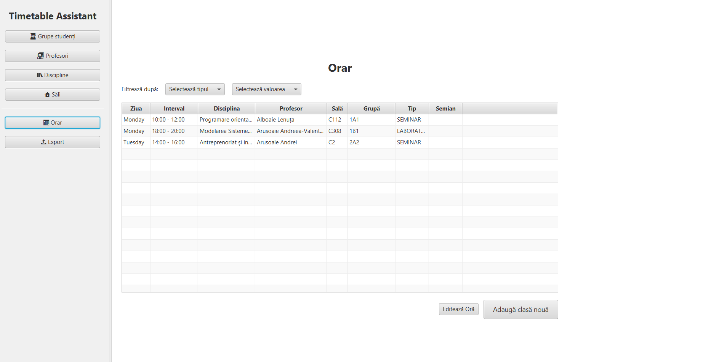
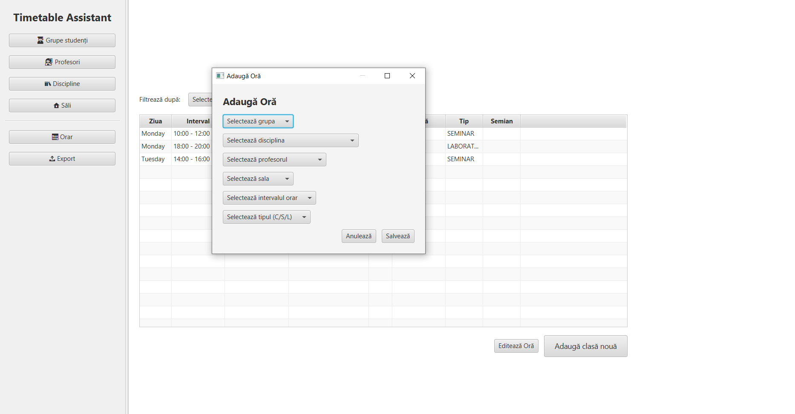
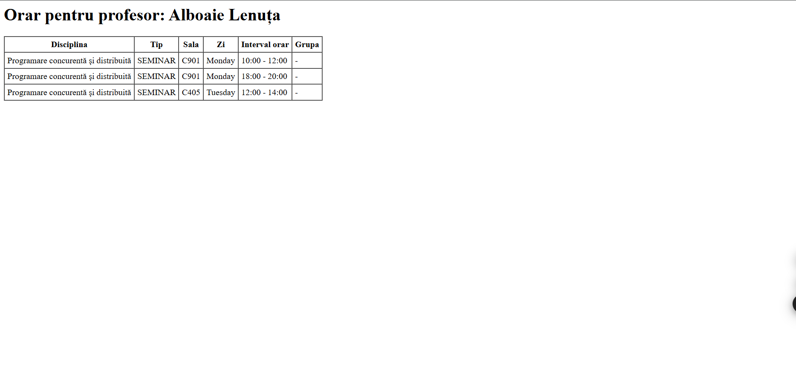

# Timetable Assistant

This is the documentation for the Timetable Assistant application, including an overview of the project, its structure, and how to run the application.

## Table of Contents

- [Program Design & Implementation](#program-design--implementation)
- [User Manual](#user-manual)
- [Unit Tests Coverage](#unit-tests-coverage)
- [Use of Assertions](#use-of-assertions)
- [Credits](#credits)

## Program Design & Implementation

This section describes the architecture, components, and functionalities implemented in the Timetable Assistant application.

The application is designed to assist users in creating and managing university timetables by handling the core entities involved: teachers, student groups, disciplines, rooms, class types, and time slots. It does not generate a timetable automatically but provides tools and validation to support manual construction.

### Architecture

The system follows a modular architecture, with each entity managed through its dedicated CRUD module. These modules handle all operations with the database using JDBC:

- **DisciplineCRUD**
- **DisciplineAllocationCRUD**
- **GroupCRUD**
- **SemiyearCRUD**
- **RoomCRUD**
- **RoomTypesCRUD**
- **TeacherCRUD**
- **TimeSlotCRUD**
- **ClassCRUD**
- **ClassTypeCRUD**

### Main Functionalities

- **CRUD Operations**: Add, retrieve, update, and delete records for each entity.
- **Constraint Validation**:
  - Classes are scheduled only on weekdays (Monday–Friday) between 08:00–20:00.
  - Courses must be placed in course rooms; laboratories in lab rooms; seminars have no room restrictions.
  - Course classes target the entire study year; seminars and laboratories target individual groups.
  - Room and teacher overlapping is prevented.
- **Conflict Detection**: Overlapping time slots and incorrect room or teacher assignments are reported.
- **HTML Export**: Generates static HTML timetables formatted similarly to the university’s official schedule.

### Design Considerations

- The implementation avoids the use of external libraries for business logic.
- All constraints and logic are enforced manually through validation code.
- The focus is on correct structure and extensibility, not on automated scheduling.
- GUI elements are considered for future phases to improve user interaction.

### Technology Stack

- **Java** for application logic
- **JDBC** for database operations
- **JUnit 5** and **Mockito** for unit testing and mocking
- **Assertions** for runtime verification of method contracts

## User Manual

### Purpose of the application

The purpose of this program is to help universities create class schedules. It offers a graphical user interface for controlling seminars, laboratories, and lectures. The application looks for schedule irregularities and conflicts, like sessions that overlap or room.

---

### Starting the application

Use IntelliJ IDEA to launch the application:
1. Launch IntelliJ IDEA and open the project.
2. Using the directory \src\main\java\org\example\timetableassistant\MainApp.java, open the MainApp.java file.
3. To start the software, click the Run button, which is typically represented by a green triangle icon.

---

### Structure of the application

Six primary components make up the program interface, which is accessed via a sidebar. Each section offers tools for adding, updating, and removing records and is devoted to handling a particular kind of data

#### 1. Groups of Students

- Shows the group number and related year for each student group that is presently stored in the database.  
- Users have the ability to add, modify, and remove groups.

#### 2. Teachers

- Provides a list of all teachers and the disciplines they instruct.  
- Indicates if they are in charge of seminars, labs, or lectures.  
- Teachers can be added, edited, or removed by users.  
 - Users can also add or remove subjects linked to individual professors.

#### 3. Subjects

 - Lists every subject that is available.  
 - Subjects can be deleted, edited, or added by users.

#### 4. Classrooms

 - Shows the names and classifications of every classroom (e.g., lecture hall, lab room).  
 - Classrooms can be added, edited, or deleted by users.

#### 5. Timetable

 - All of the scheduled classes are listed in this main area.(example in **Figure 1**)

*Figure 1: Page for schedule manipulation*  
 - The schedule can be filtered by subject, lecturer, classroom, or student group.  
 - To add a new class, users can press the specific button("Adauga clasa"), in which they can complete a form with the following information(example in **Figure 2**):  
   - Group of students  
   - Subject: Instructor in the Classroom  
   - Duration of time  
    - Class type (lecture, lab, or seminar)

*Figure 2: Add new class form*
- The same form is used for editing one selected class that is present in the schedule.
- The application looks for scheduling conflicts when trying to save a class and shows a warning if any are found. Classes that are in conflict won't be saved. The warnings are explained in **Validation of Conflicts and Error Messages** subchapter.

#### 6. Export Timetable

 - Schedules can be exported to.html files by users.  
 - Timetables for classes, subjects, professors, and student groups are among the export choices.  
 - For a clear and easy-to-use perspective, the exported files can be opened in any web browser after being saved locally.

*Figure 3: Example of html page containing the schedule of one teacher*

---

### Validation of Conflicts and Error Messages

The application automatically checks for scheduling conflicts when adding or changing a class:

- **Room Conflict**
  - Alert: "Conflict with existing class in the same room at the same time."  
  - If there is another class booked in the same room at the designated time, it gets triggered.

- **Teacher Conflict**
   - Alert: "Conflict with existing class for the same teacher at the same time."  
  - Triggered in the event that the instructor is concurrently assigned to another class.

- **Group Conflict**
   - Alert: "Conflict with existing class for the same group at the same time."  
  - If the student group has another class planned at the same time, it will be triggered.

In every instance, the user is notified of the particular problem and the conflicting class cannot be stored.

## Unit Tests Coverage

This part covers the unit tests for the CRUD (Create, Read, Update, Delete) operations of the Timetable Assistant application.
The tests use JUnit 5 and Mockito to mock database interactions and verify the behavior of each CRUD class.

### Covered Entities and Operations

- **DisciplineCRUD**
  - Insert, get by ID, update, delete, get all disciplines
  - Handles success, not found, and SQL exception scenarios

- **GroupCRUD**
  - Insert, get by ID, get by number and semiyear, update, delete, get all groups
  - Tests for empty results, not found, and SQL exceptions

- **RoomCRUD**
  - Insert, get by ID, update, delete, get all rooms
  - Covers success, not found, and error cases

- **RoomTypesCRUD**
  - Insert, get by ID, update, delete, get all room types
  - Includes tests for not found and SQL errors

- **TeacherCRUD**
  - Insert, get by ID, update, delete, get all teachers
  - Tests for both successful and failing operations

- **TimeSlotCRUD**
  - Insert, get by ID, update, delete, get all time slots
  - Handles empty, not found, and exception cases

- **ClassCRUD**
  - Insert class (COURSE, LABORATORY, SEMINAR): success, validation failures, SQL exceptions
  - Get class by ID: success, not found, SQL exceptions
  - Update class: success, not found, SQL exceptions
  - Delete class: success, not found, SQL exceptions
  - Get classes by group ID, room ID, semiyear, teacher ID, discipline ID: success, no results, SQL exceptions
  - Get all classes: success (multiple results), no results, SQL exceptions

### Testing Approach

- All tests use Mockito to mock JDBC connections, statements, and result sets.
- Each CRUD method is tested for:
  - Successful execution
  - Handling of not found records
  - SQL exceptions and error messages
- Assertions verify both the operation result and the correctness of returned data or error messages.

## Use of Assertions

Assertions have been used for checking most preconditions / postconditions / loops of the methods of classes beloging these class archetypes:
- Service
- Handler
- CRUD
- Model

For Model classes, an additional "assertCurrentState" method has been added for checking the validity of the current state. 
The method "assertCurrentState" is called inside other state-changing methods.
All asserts check if variables are null / strings are empty / ids are less or equal to 0

## Credits

* Aron Robert(Contributions: App interface, updates to service logic, unit tests for group and class modules, and project documentation.)
* Chichirau Claudiu
* Dulhac Alexandru
* Onofrei Maria

_Quality of Software Systems Project
[Masters Year 1 - 2025]_
